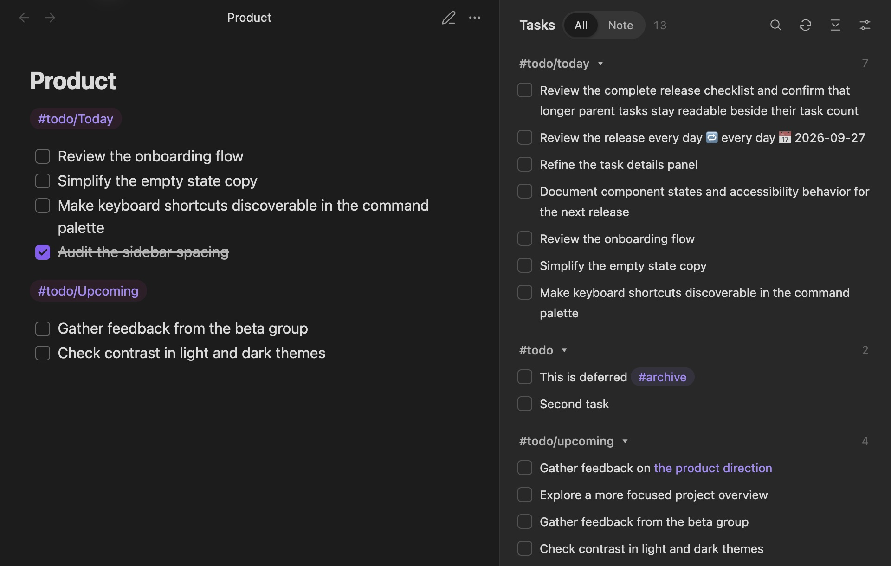
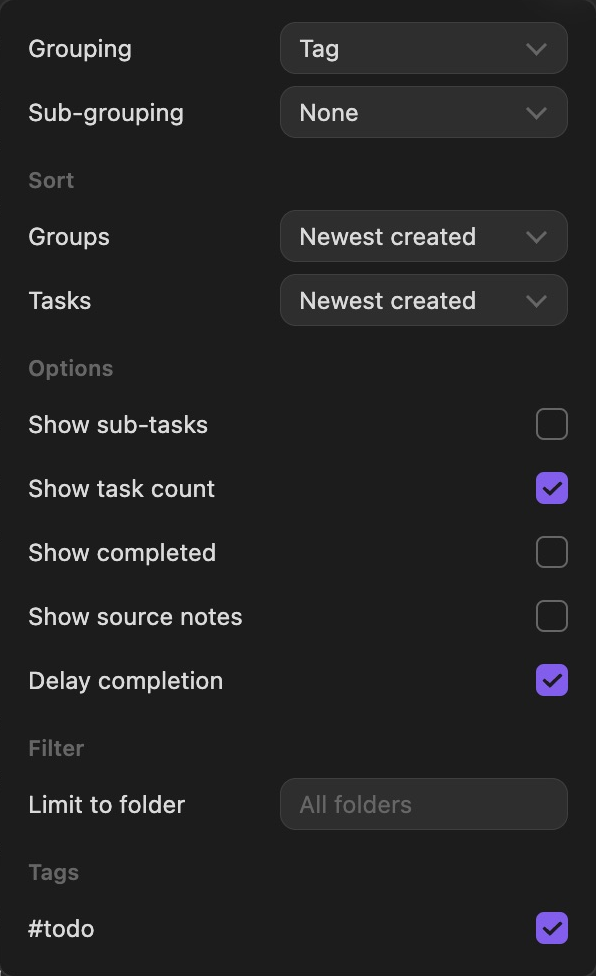

# Checklist for Obsidian

This plugin brings checklists from across your notes into a single sidebar. Check things off, find the note they came from, and organize the list how you like.



## Usage

Install **Checklist** from Obsidian’s community plugins and enable it. Open the sidebar from the ribbon or run **Checklist: Show Checklist pane** from the command palette. Requires Obsidian 1.5.0 or later.

By default, blocks of checklist items tagged with `#todo` appear in the sidebar:

```markdown
#todo
- [ ] Review the sidebar
- [ ] Write release notes
```

A standalone tag applies until the next blank line. You can also tag individual tasks, use nested tags like `#todo/next`, or put a tag in a note’s `tags` property to include the whole note.

Check items off in your note or in the sidebar; both update the same Markdown file. Completed tasks stay visible for one second so you can uncheck an accidental click. Click the task text to jump to its source line.

Use **All / Note** to switch scope, or search task text, note paths, and tags. Click an inline tag to search for it.

## Configuration

Open the sidebar’s **Display options** for everyday controls. Tag sources, file patterns, and integrations live in **Settings → Checklist**.



**Grouping:** Group by Tag, Page, or Folder, or choose None for one list. Add a different sub-grouping if you want a second level. Click the arrow to collapse a group.

**Sorting:** Sort by name, file creation time, or recent modification. Tasks can also follow their order in the note; tag groups can follow your configured tag order. **Groups** sorts both grouping levels.

**Options:** Show sub-tasks, task counts, completed tasks, or source-note labels. **Show sub-tasks** includes children of tagged tasks and displays an expandable tree. Turn off **Delay completion** to hide completed tasks immediately.

**Included / excluded tags:** One per line, with or without `#`. `todo/next` matches that tag and its descendants, but not `todo/next-week`. Leave Included tags empty to show all tasks. Excluded tags hide matching tasks and blocks; an excluded property tag hides the whole note.

**Include all tasks in matching notes:** Include every task in a note containing a matching tag, rather than just its tagged tasks and blocks.

**Limit to folder:** Enter a vault-relative folder to include it and its subfolders. Clear the field to show all folders. You can also right-click a folder in the file explorer to focus Checklist there.

Defaults keep tag grouping, newest-created ordering, and a flat task list. Existing preferences are preserved on upgrade; nested groups, sub-tasks, source notes, and Tasks integration are opt-in.

## File patterns

Use one [minimatch](https://github.com/isaacs/minimatch) glob per line in **File patterns**. Positive patterns include files; `!` patterns exclude them. Leave empty to include every note.

```text
Projects/**
Daily/**
!Projects/Archive/**
!Daily/Templates/**
```

With only exclusion patterns, everything else is included.

## Tasks integration

Enable **Complete with Tasks** to use the [Tasks plugin](https://github.com/obsidian-tasks-group/obsidian-tasks) for completion dates and recurring tasks. Requires Tasks 7.2 or later. This is optional and off by default; custom-status filtering is not supported.

## Development

Use Node 20.19+:

```sh
npm ci
npm test
npm run build
```

`npm run dev` watches source files. Copy `main.js`, `styles.css`, and `manifest.json` into a test vault’s `.obsidian/plugins/obsidian-checklist-plugin/` and reload Obsidian.

Thanks to [SeanYHan888](https://github.com/SeanYHan888) for the sub-task hierarchy work in [#213](https://github.com/delashum/obsidian-checklist-plugin/pull/213).
